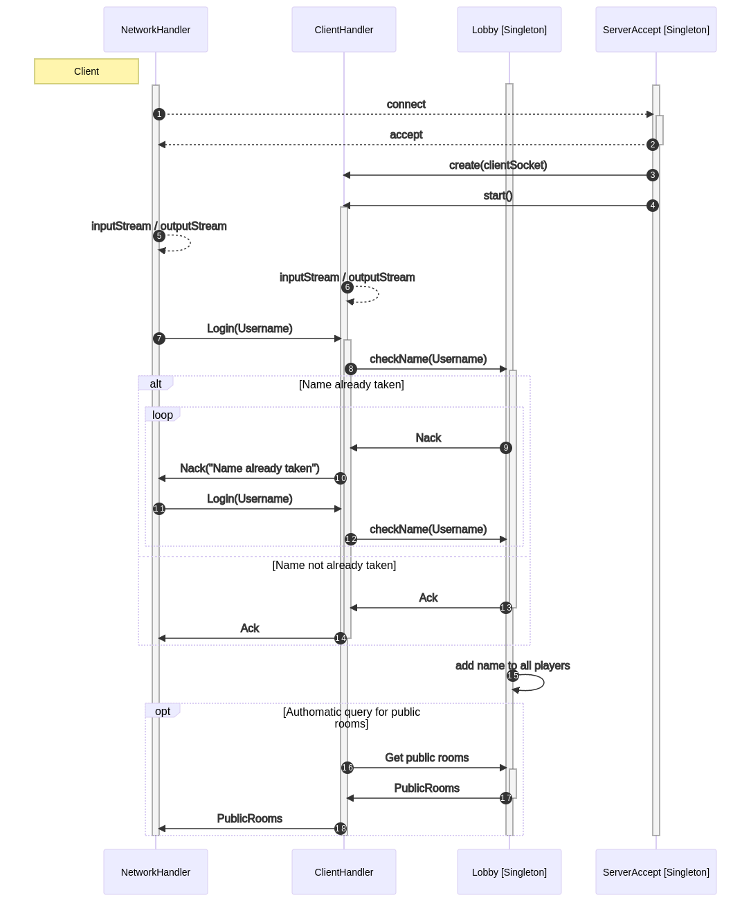
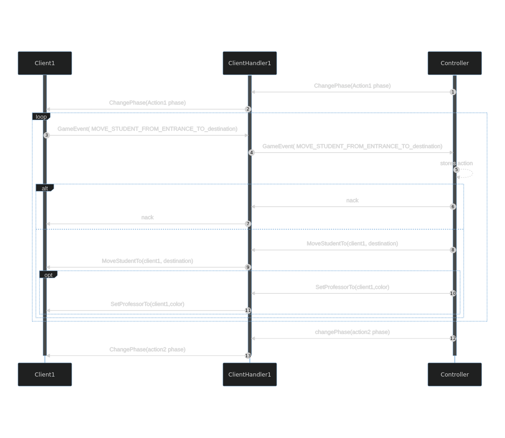
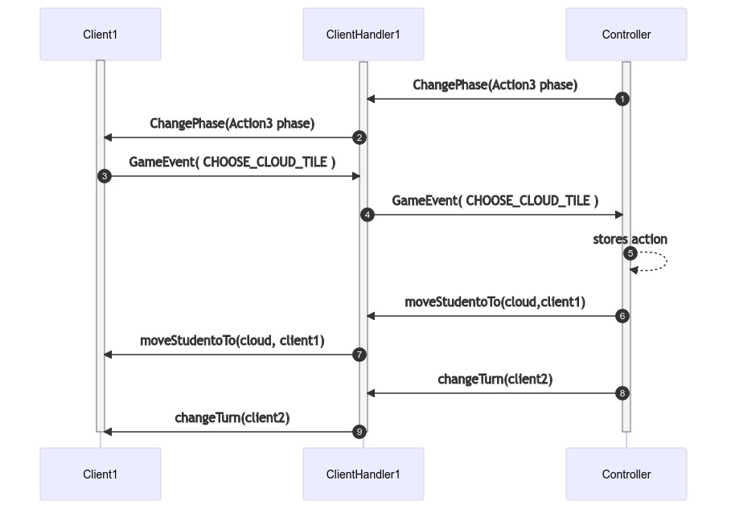

# Eryantis Protocol Documentation

Virginia Longo, Marco Molè, Pierluigi Negro

Group 3

## 1. Messages

### 1.1. Acknowledgment (ack)

This message is sent from the server to a single client when a generic message received from that client has been acknowledged.

#### Arguments

This message has no arguments.

#### Possible responses

This message has no responses.

### 1.2. Negative Acknowledgment (nack)

This message is sent from the server to a single client when a generic action was not permitted. It is interpreted from the network handler depending on scenarios.

#### Arguments

- ErrorMessage: the entity of the error

#### Possible responses

This message has no responses.

### 1.3. Login

This message is sent from the client to the server after establishing a connection to create a player session.

#### Arguments

 - Username: the unique name that will identify a player

#### Possible responses

 - Ack: the name is unique and the user has been logged
 - Nack: the name is not unique and the user has not been logged

### 1.4. CreateRoom

This message is sent from the client to the server to create and access a new room.

#### Arguments

 - Number of players: the number of players that will participate in the game (2, 3, 4)
 - Expert: flag that sets the game to expert if true
 - Private: flag that sets the room to private if true

#### Possible responses

 - Ack: when the room was correctly created
 - Nack: when there were errors in the making of the room

### 1.5. RoomId

This message is sent from the server to the client that creates a game, in order to communicate the roomId. This information is necessary for other clients in order to access the created game.

#### Arguments

 - roomId: the room identifier

#### Possible responses

 This message has no responses.

### 1.6. GetPublicRooms 

This message is sent from the client to the server to get a list of all public rooms currently initializing, along with the number of players that that room will hold and if the game played in the room will be in expert mode.

#### Arguments

This message can have optional parameters to filter through all games:
 - number of players (2, 3, 4): asks for a public game of that many players
 - expert (boolean): asks for a public game in expert mode 

#### Possible responses

 - PublicRooms: if the parameters where not illegal
 - Nack: if number of player is not in (2, 3, 4)

### 1.7. PublicRooms 

This message is sent from the server to the client after he logs in, or in response to a GetPublicRooms message. It holds a list of all public games (or the ones that meet the criterias of the request) and their relative information.

#### Arguments

 - publicRooms: a collection that holds the information about the rooms

#### Possible responses

This message has no responses. 

### 1.8. AccessRoom 

This message is sent from the client to the server, in order to access a room.

#### Arguments

 - roomId: The identifier of the room that the player wants to enter. 

#### Possible responses

 - Ack: if the player has been added to the room
 - Nack: if the room does not exist or if the room is already full

### 1.9. AddPlayer 

This message is sent from the server to the client, while the client is in a room, in response to players being added to the room.

#### Arguments

 - player: the username of the player added
 - Color: the TowerColor of the player added 
 - Position: the position of the player around the table

#### Possible responses

This message has no responses.

### 1.10. StartGame 

This message is sent from the server to all clients in a room when all playing players have been added to the room, to indicate that the game can start.

#### Arguments

This message has no arguments.

#### Possible responses

This message has no responses.

### 1.11. MoveStudent 

This message is sent from the server to all clients in a room in order to communicate the movement of a student, as a consequence of a GameEvent or an internal event.

#### Arguments

 - from: the place where the student has been taken from
 - to: the place where the student is added
 - color: the color of the student

#### Possible responses

This message has no responses.

### 1.12. AddStudentTo 

This message is sent from the server to all clients in a room in order to communicate the placement of a student, as a consequence of a GameEvent or an internal event.

#### Arguments

 - where: the place where the student is added
 - color: the color of the student

#### Possible responses

This message has no responses.

### 1.13. MoveTower 

This message is sent from the server to all clients in a room in order to communicate the movement of a tower, as a consequence of a GameEvent or an internal event.

#### Arguments

 - from: the place where the tower has been taken from
 - to: the place where the tower is added

#### Possible responses

This message has no responses.

### 1.14. MergeIslands 

This message is sent from the server to all clients in a room in order to communicate the merging of two islands.

#### Arguments

 - firstIsland: the index of the first island 
 - secondIsland: the index of the second island 

#### Possible responses

This message has no responses.

### 1.15. SetProfessorTo 

This message is sent from the server to all clients in a room when the ownership of a professor is changed.

#### Arguments

 - professor: the color of the professor to consider
 - player: the username of the player that now owns the professor

#### Possible responses

This message has no responses.

### 1.17. PlayAssistanCard 

This message is sent from the server to all clients in a room in order to communicate that the current playing player has played a card.

#### Arguments

 - AssistantCard: the AssistantCard that is picked

#### Possible responses

This message has no responses.

### 1.17. ActivateCharacterCard 

This message is sent from the server to all clients in a room in order to communicate the activation of a CharacterCard.

#### Arguments

 - CharacterCard: the CharacterCard that is activated

#### Possible responses

This message has no responses.

### 1.18. AddCoin

This message is sent from the server to all clients in a room when a coin is given to a player.

#### Arguments

 - player: the username of the player that receives the coin

#### Possible responses

This message has no responses.

### 1.19. RemoveCoin

This message is sent from the server to all clients in a room when a coin is taken from a player.

#### Arguments

 - player: the username of the player that loses the coin

#### Possible responses

This message has no responses.

### 1.20. ChangePhase 

This message is sent from the server to all clients in a room when the phase changes.

#### Arguments

 - phase: the phase the game changes into

#### Possible responses

This message has no responses.

### 1.21. ChangeTurn

This message is sent from the server to all clients in a room when the turn changes.

#### Arguments

 - player: the username of the player that is now to play

#### Possible responses

This message has no responses.

### 1.22. GameEvent 

This is a message sent from the client ot the server specifing the game action that the player took. Each type of game event has its own arguments. The server uses the enum value to operate a cast in order to access the values of the event.

#### Arguments
 - Player: the  username of player that generated the event
 - Type: an enum value that indicates what is the event
    1. PLAY_ASSISTANT_CARD //planning phase
    1. MOVE_STUDENT_FROM_ENTRANCE_TO_ISLAND //actionPhase
    1. MOVE_STUDENT_FROM_ENTRANCE_TO_TABLE  //actionPhase
    1. MOVE_MOTHER_NATURE //actionPhase
    1. CHOOSE_CLOUD_TILE //actionPhase
    1. ACTIVATE_CHARACTER_CARD //actionPhase  
    1. MOVE_STUDENT_FROM_CARD_TO_ISLAND //CardRelated
    1. CHOOSE_COLOR //CardRelated
    1. CHOOSE_ISLAND //CardRelated
    1. SWAP_STUDENT_CARD_ENTRANCE //CardRelated
    1. SWAP_STUDENT_ENTRANCE_TABLE //CardRelated
 - (opt) AssistantCardValue: the assistant card played (only in type 1)
 - (opt) Color: the  firstcolor chosen (2,3,7,8,10,11)
 - (opt) Island index: the island chosen in (9)
 - (opt) MoveAmount: the movement done by mother nature in (4)
 - (opt) Color2: the second color chosen in (10,11)
 - (opt) ActivatedCard: specifies which card is being activated in (6)
 - (opt) Cloud index: the cloud choosen in (5)

#### Possible responses

 - Nack: if the event was illegal at the moment it was sent or if it had illegal arguments
 - Messages from 1.11 to 1.21 rappresent the type of message that will be received by all clients if the event was successful

### 1.23. EndGame 

This message is sent from the server to all clients in a room when the game ends, communicating the winners of the game. No ties exist, there can be multiple winners instead.

#### Arguments

 - winners: a list of the game winners

#### Possible responses

This message has no responses.

### 1.24. LeaveRoom 

This message is sent from the client to the server, after the game ends, in order to exit the room.

#### Arguments

This message has no arguments.

#### Possible responses

 - Ack: when the room was correctly exited
 - Nack: when the game was not ended

## 2. Scenarios

### 2.1 Game Access

To better describe what happens in the "Game Access" phase, seen as we decided to implement the multiple simultaneous games mechanic, we will divide into two separate sequence diagrams what actions take place.

#### 2.1.1 Login

Seen as the Username univocally identifies the player, the login phase makes sure that the player cannot log in until a unique name is given. We can see the ack/nack mechanic shown in this diagram: such aspect of the protocol is used in all scenarios, but for simplicity, we will omit it from this point forth.

#### 2.1.2 Accessing a Room

We can see here how there are two ways of entering a new game: by creating a new room or by accessing an initializing room. Trying to acces a non initializing room or a non-exhisting room will result in a Nack. Users can furthermore search for a public room's id, or enter a private room id, to join in a new game. Creating a room will always result into joining said room.

### 2.2 Planning Phase

In the planning phase the turn changes according to the order in which players are to select an Assistant card. During this turn change the current playing player can only pick the assistant according to the rules. After the planning phase a new order is decided for the rest of the round.

### 2.3 Action Phase 1

### 2.4 Action Phase 2 

### 2.5 Action Phase 3

